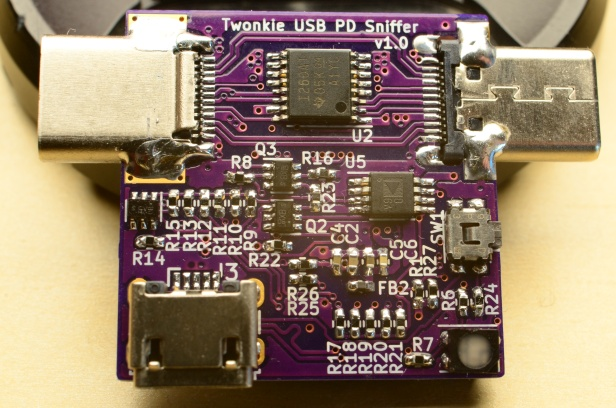
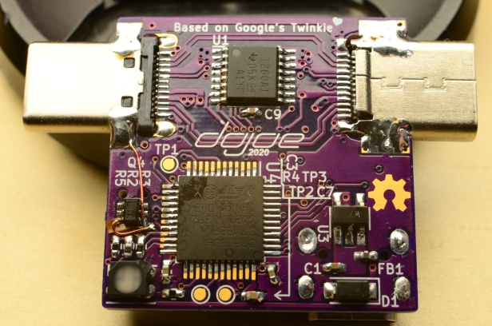

# Twonkie - a USB-PD sniffer based on Google's [Twinkie](https://www.chromium.org/chromium-os/developer-library/guides/hardware-schematics/twinkie/)

Twonkie is a USB-PD sniffer/injector/sink based on a Google project called Twinkie, re-engineered to be made in one-off quantities by mere mortals.

Twinkie is a great and pretty low-cost solution, and it's open-source so anyone could make their own, but unfortunately the Twinkie design uses a six-layer PCB and all BGA/wafer-scale parts - both of which are usually unavailable to the humble hobbyist.

So I designed the Twonkie, a slightly wonky sibling of Twinkie. It uses a four-layer PCB that can be manufactured cheaply by lots of services like OSHPark, and it makes a point to use only leaded parts for easier soldering (though the main microcontroller can optionally be QFN too via a dual footprint). The most difficult parts are likely the passives which are all 0402, and the USB-C connectors which are used in an unconventional way by misusing 90° upright connectors as 1.6mm straddle mounts (living up to the concept of being wonky).

## What does it look like?

Lookie here!

The PCB is exactly 1 inch squared, so $10 will get you three at OSHPark. In fact, let me take care of that for you:

<a href="https://oshpark.com/shared_projects/VxczZuoj"></img></a>

_(Disclaimer: I am not affiliated with OSHPark, I just love their service to bits and they've been super helpful chaps time and time again.)_

The v1.0 and v2.0 Gerbers in this repo no longer need the botch wires around Q4 either, I'll update the photo as soon as I get the next board revision back.

## What's changed compared to the original Twinkie?

 * A bootloader button in addition to the USB_ID pin based bootloader selection.
 * Uses the INA237 part which supports the higher supply voltages of USB-PD Extended Power Range (EPR)
 * The microcontroller pins are rearranged for easier routing, so you'll need a different firmware. Binaries are provided and the firmware is easy to build from source.
 * The USB-C connectors are attached in a hair-raising straddle mount configuration. The way they're soldered to the PCB makes them rock solid though, maybe even more solid than the original Twinkie, and they transfer TB3 20Gbit/s lanes just fine.

## I see there's a v2.0 now - what's different?

The 2.0 version uses a different voltage/current monitor chip compared to Twonkie v1.0, the [INA237](ref/ina237.pdf), which supports higher bus voltages and therefore makes the Twonkie hardware ready for Extended Power Range (EPR). The INA260 used by Twonkie v1.0 (and the INA231 used by Twinkie) will take damage if subjected to the up to 48V specified by EPR.

## Sweet! How do I build my own?

I'm glad you asked! Get the board made via the OSH Park link above, or supply the v2.0 Gerbers in this repository to a PCB fab of your choice, get the parts from Digikey or Mouser or what have you, and follow the [Assembly instructions](hw/README.md) to build the device. I recommend ordering a few extra parts: Get one more of each Type-C connector since you're going to modify them in ways that might end up with a broken connector, and generously round up the number of 0402 passives since you're going to drop some of them and you will _never_ find them again :)

For the firmware, there are [Instructions for building and flashing](fw/README.md) in the [fw](fw) directory.

## None of the parts are available 😭 What do I do?

Here are some ideas about replacements for some parts that are most likely to be unavailable. None of these have been tested so you're on your own!

 * **INA237:** The INA237 is part of a device family and has two siblings with higher specs that TI claims are drop-in replacements: INA228 and INA238.
 * **STM32F072CB:** For one, the Twonkie has a dual footprint that will fit both the TQFP and QFN variants, i.e. the STM32F072CBT and STM32F072CBU. And if you are willing to sacrifice the PD sink functionaliy and only need the sniffer functionality you could also try the variants with 64k flash instead of 128k (STM32F072C8*) and only flash the first half of the firmware binary. Other device families than the F072 would require extensive firmware changes so I can't recommend that.
 * **USB-C plug / receptacle:** These might be a little trickier. Basically you need one that's meant for being mounted standing up on a board, has all USB-C pins wired out to L shaped pins and doesn't have any metal mounting prongs protruding into the board plane (or if it has you'll have to cut them off).

## I am a noob trying to solder and replicate the Twonkie. Got any beginner tips?

The KiCad schematic file contains the vendor part numbers and DigiKey order numbers for each part designator, and I exported the full list into a .csv file too - those are commonly called "Bill of materials" or BOM for short, and [this is the one for Twonkie 2.0](hw/v2.0/twonkie.bom.csv). You should be able to punch those part numbers into a parts supplier of your choice (I usually use [DigiKey](https://digikey.com/) but there are plenty others) to find the parts you need. If they have parts in stock they'll happily sell you small quantities, though at an increased price. Take care to order more of most parts than you need - especially the tiny passives (resistors, capacitors...) are easy to lose during assembly.

As for reading the schematic, it probably helps to have some familiarity with [USB-PD](https://www.usb.org/document-library/usb-power-delivery) and the [original project description](https://www.chromium.org/chromium-os/developer-library/guides/hardware-schematics/twinkie/), and then read up on the [device datasheets](ref/) to understand which part does what.

Having said all that, please be warned that the Twonkie is not exactly a noob project - unless you're already familiar with hand-soldering fine pitch SMT parts you may be in for a frustrating experience. Don't let that keep you from trying, but you should know what you're signing up for :)

# TODOs

 * [ ] Get Twinkie support upstreamed in sigrok/PulseView
 * [ ] v2.0 photos

# Similar projects

 * As luck would have it, [Greg Davill](https://github.com/gregdavill) started a project with the exact same goal at a very similar time, so there's now two of us :) https://github.com/gregdavill/PD-sniffer
 * [XenGi](https://github.com/XenGi) built a version of Twonkie v2.0 which uses a 0.8mm PCB and industry-standard straddle mount USB-C connectors. After [a bit of deliberation](https://github.com/dojoe/Twonkie/issues/10) I decided to stick with the 1.6mm PCB for stability and availability reasons but if you prefer a less haxxy way of attaching the connectors (and a 3D printed case!) feel free to check out his repo: https://gitlab.com/XenGi/Twonkie
   
# Licenses

## Hardware (as found in the `hw` subdirectory)

The hardware design of <a property="dct:title" rel="cc:attributionURL" href="https://github.com/dojoe/Twonkie">Twonkie</a> by <a rel="cc:attributionURL dct:creator" property="cc:attributionName" href="https://github.com/dojoe">Joachim "dojoe" Fenkes</a> is licensed under <a href="http://creativecommons.org/licenses/by/4.0/" target="_blank" rel="license noopener noreferrer" style="display:inline-block;">CC BY 4.0</a>

## Firmware (as found in the `fw` subdirectory)

The source code for the Twonkie's firmware is licensed under the 3-clause BSD license, see [its LICENSE file](fw/LICENSE).
