# Before you begin

## Recommended tools (apart from the usual)

The board is too tiny to stay put from its own weight so you'll need a proper vise. "Third Hand"s are no good for this since they can't clamp small boards properly and aren't stable enough. I recommend a StickVise or similar.

[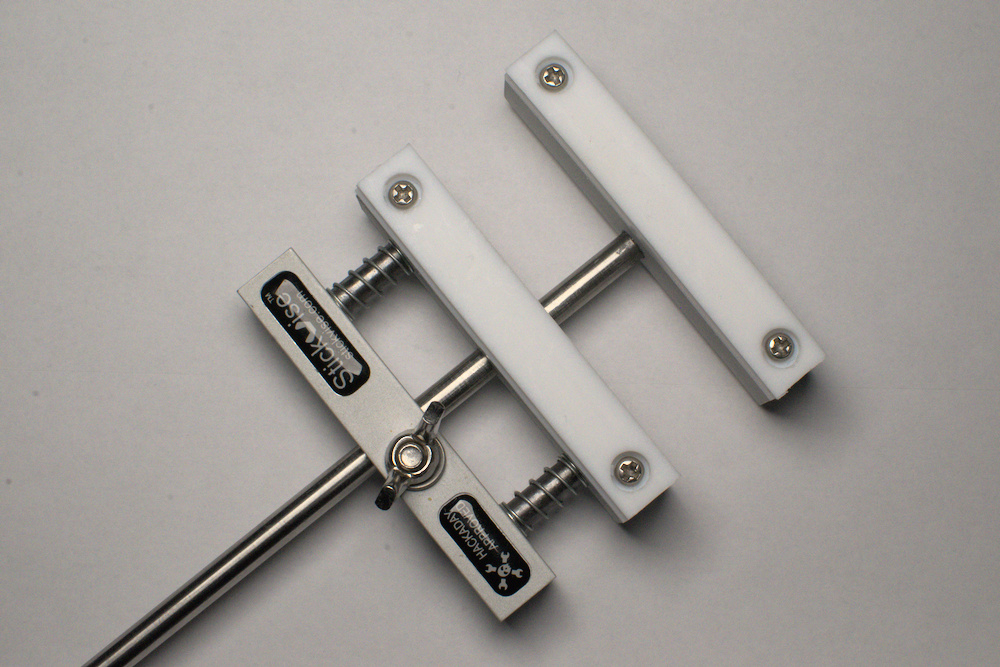](assembly_pics/tools5.jpg)

A knife with a straight, strong blade.

[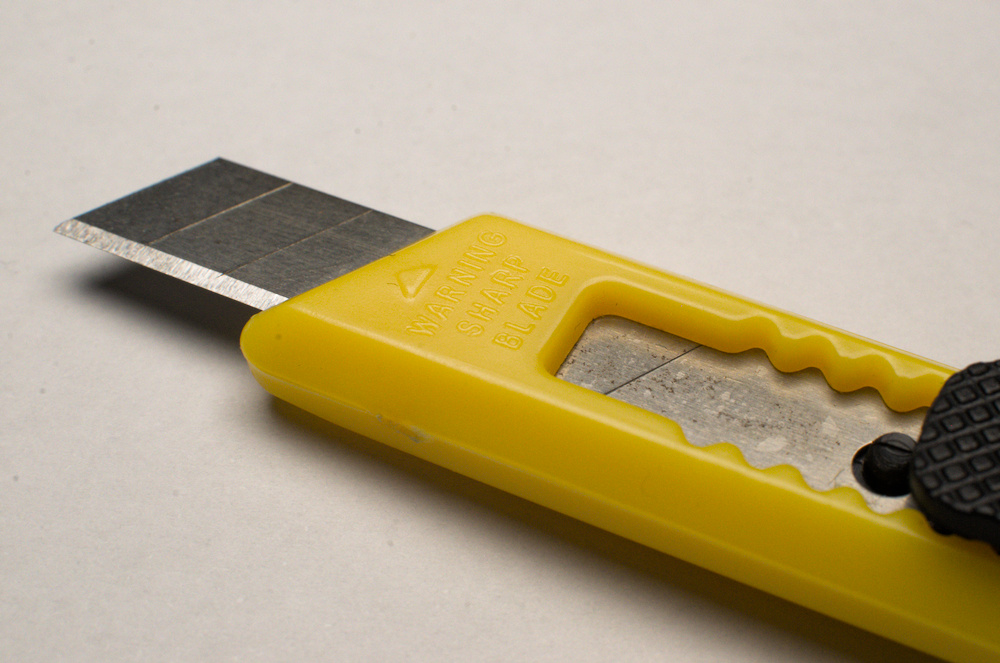](assembly_pics/tools1.jpg)

Non-serrated pliers.

[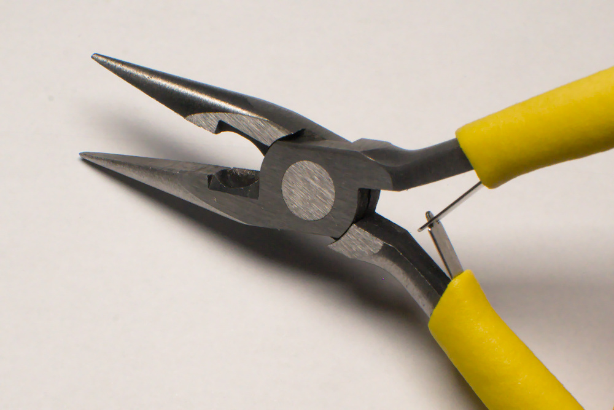](assembly_pics/tools2.jpg)

You can solder everything using a smallish chisel tip and you'll be fine.
For enhanced comfort, a fine angled tip makes the passives much easier. I used a TS80-J02 with great success.

[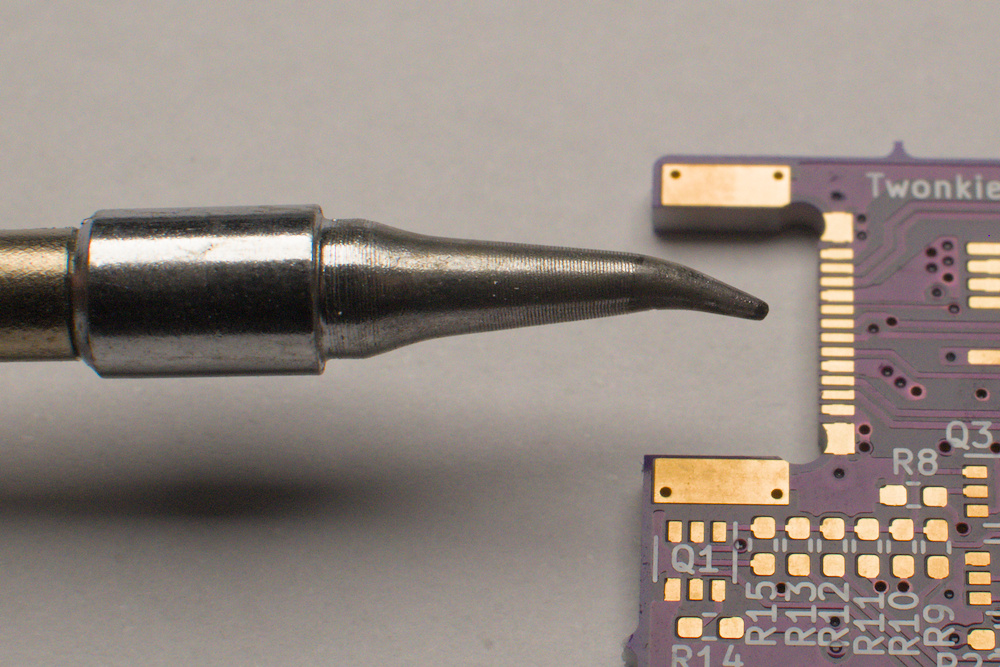](assembly_pics/tools3.jpg)

Gel flux. Liquid flux evaporates too quickly for my taste. I use Edsyn FL-22 for everything but there's plenty other good stuff out there too.

[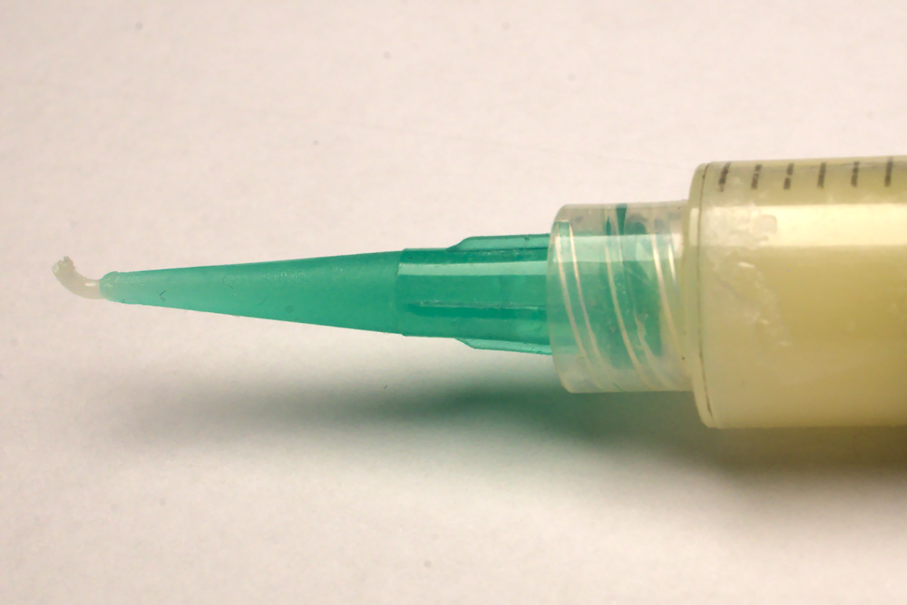](assembly_pics/tools6.jpg)

A watchmaker's loupe, more for inspection than for the actual soldering. Of all the tools I acquired last year, this super cheap 7x loupe made the biggest difference and it's never leaving my workbench again. Have a strong light (such as a phone camera LED) at the ready for inspection too, there's no such thing as "too much light".

[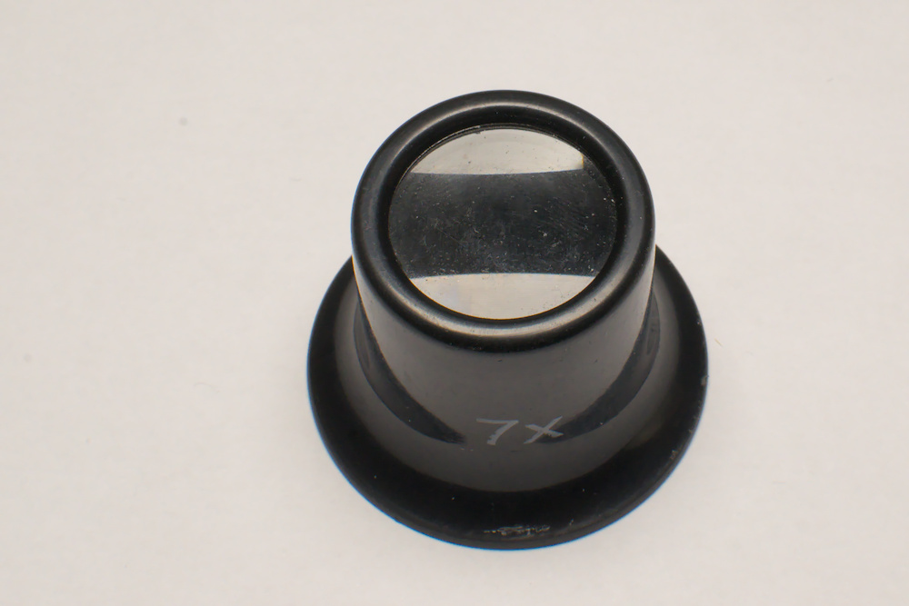](assembly_pics/tools4.jpg)

## General tips

 * Keep both the schematics and the board file open while you build, you'll likely want to refer back to them more often than not.

 * I wholeheartedly recommend this thread by [@thingskatedid](https://twitter.com/thingskatedid): https://twitter.com/thingskatedid/status/1348234262886039558

 * **The passives are indistinguishable once taken out of their tapes!**
   * Always work with a single value at a time
   * Only remove as many components from the tape as you need right now
   * Immediately put the tape back into the pouch it came in, as that's where the value is noted - or write the value onto the tape.

 * For each group of passives below, it saves time to batch up different types of operations: First put a small solder blob on one pad of each site, then tack down each component, then solder the other side for all components in a row.

 * If the solder joints on nearby passives blob together a lot, use some flux and a little less solder. It's also a good idea to make a final flux pass across the finished passives just like you would be drag soldering a leaded part, it makes the solder joints look a lot nicer.

# Assembly instructions

These instructions are optimized for hand assembly; the components are grouped in a way that if you follow the groups in order you should never have one component in the way of soldering another. Within a given group the order does not matter; I recommend doing all components of one value before moving on to the next value.

The overall order of assembly is:
 1. Back side components
 2. Front side components
 3. Basic connectivity/bootloader test
 4. USB-C connectors

## Part 1: Back side

We start on the back side because that's where the STM32 sits which is the most daunting to solder, and because the components on that side are generally flatter so if you _have_ to solder without a vise they won't make the board as wobbly when you do the front side.

If your STM32 is a QFN part, take extra care to inspect its solder joints after you put it down. Once the board is fully populated any bad solder joints here will be hard to fix.

| Group | Components          | Value        |
|-------|---------------------|--------------|
| 1     | U4                  | STM32        |
| 2     | R3                  | 400          |
|       | R2, R5              | 620          |
| 3     | DS1                 | LED          |
| 4     | C3, C8              | 100n         |
|       | C7                  | 4.7µ         |
|       | C1                  | 1µ           |
|       | R4                  | 400          |
|       | FB1                 | Ferrite Bead |
| 5     | D1, U1, U3, Q4, R28 |              |

## Part 2: Front side

| Group | Components                 | Value         |
|-------|----------------------------|---------------|
| 6     | Q1, Q2, Q3                 | NFET          |
| 8     | R9, R17, R25, R26          | 4k75          |
|       | R10, R18                   | 1k            |
|       | R11, R19                   | 12k1          |
|       | R12, R20                   | 5k11          |
|       | R6, R7                     | 400           |
|       | R15, R23, R24              | 100           |
|       | R14, R22                   | 200           |
| 9     | R1, R8, R13, R16, R21, R27 | 35k7          |
| 10    | C2                         | 4u7           |
|       | C4, C9                     | 100n          |
|       | C5                         | 1u            |
|       | C6                         | 10n           |
| 11    | FB2                        | Ferrite Bead  |
| 12    | DS2, U5, U2, J3, SW1, R29  |               |

## Part 3: Basic connectivity / bootloader test

This step is done on the not-quite-finished Twonkie because if anything isn't right the board is much easier to hold in the vise without two USB-C connector sticking out.

1. Double check all components:
   * Are all ICs oriented the right way?
   * Did you miss any solder joints?
   * Do you see any obvious solder bridges?
2. Measure resistance between the 3V3 rail and GND, this is easiest at the output side of U3.
   Kiloohms are good, Ohms are an indication of a short somewhere.
3. Do the same on the input side of U3.
4. Hold down the bootloader switch and plug the dongle in via the Micro-B connector.
   It should now enumerate as the bootloader (VID 0x0483, PID 0xDF11, "STM32 BOOTLOADER")
5. Flash the firmware via the bootloader, then unplug and plug back in to boot the Twonkie firmware.
   * Check out the [Firmware README](../fw/README.md) for building and flashing instructions.
6. You can test the LED using the serial shell:
   * `tw sink` puts the device into sink mode where the firmware doesn't keep overwriting the LED state.
     You may need to reconnect the shell after this.
   * `gpioset LED_B_L 0` turns the blue LED on, `gpioset LED_B_L 1` turns it off.
   * Same for `LED_R_L` and `LED_G_L`
7. Check I2C connectivity to the two INA260 monitors:
   * `ina 0` attempts to access U1, `ina 1` does so for U2

That's all we can test for now, let's finish the board next.

## Part 4: USB-C connectors

The USB-C connectors are used in an unorthodox way: Straddle mount USB-C connectors for 1.6mm boards don't exist, so we take connectors meant for right-angle surface mounting and modify them into our own custom straddle mount configuration. With those modifications the solder connections work really well, and we achieve mechanical stability by soldering the connector shields to the board all around.

We start out with the unmodified connector. This is the receptacle but the steps for the plug are identical.

[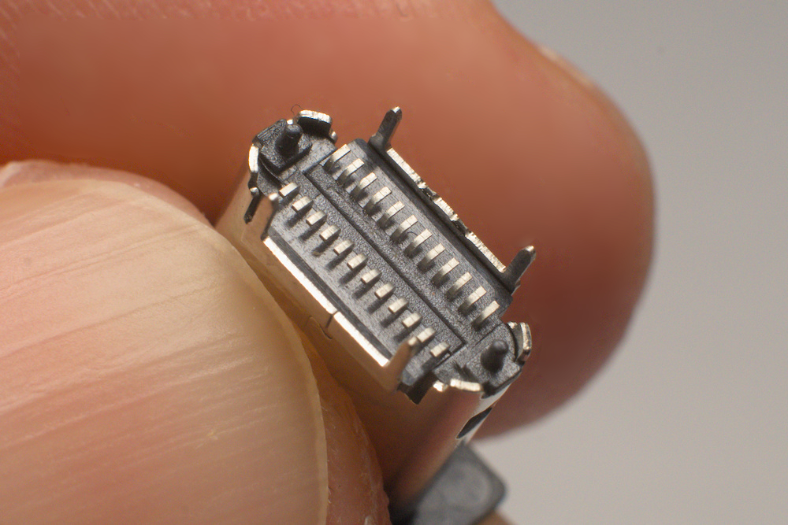](assembly_pics/typec01.jpg)

First, the mounting legs have to get out of the way. Grab them with your pliers and bend them back and forth until they break off.

[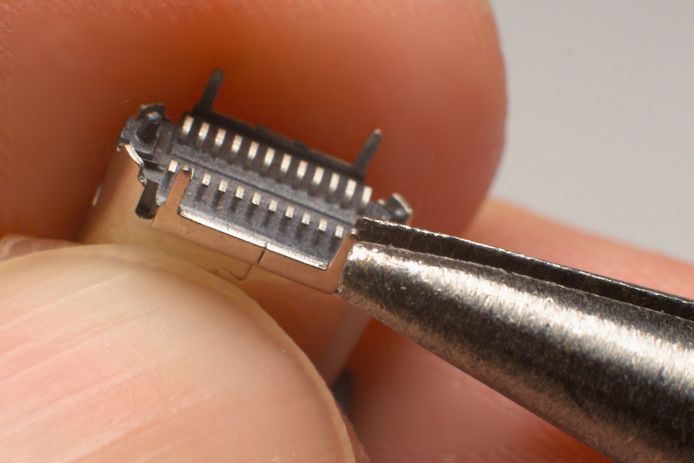](assembly_pics/typec02.jpg)[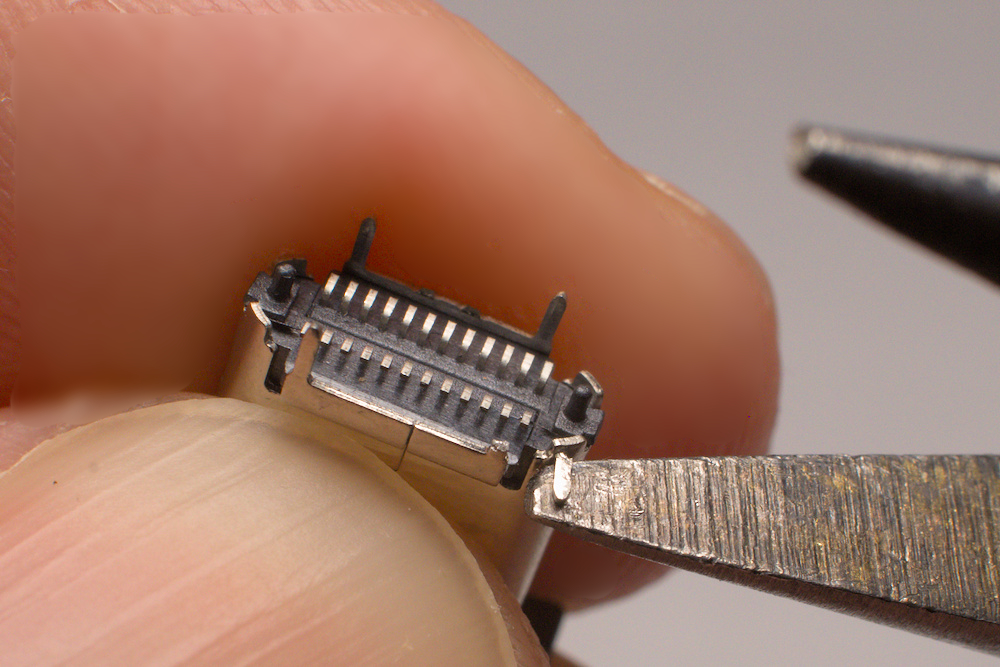](assembly_pics/typec03.jpg)

Next up, the locating pegs have to go too. Cut them off close to the base.

[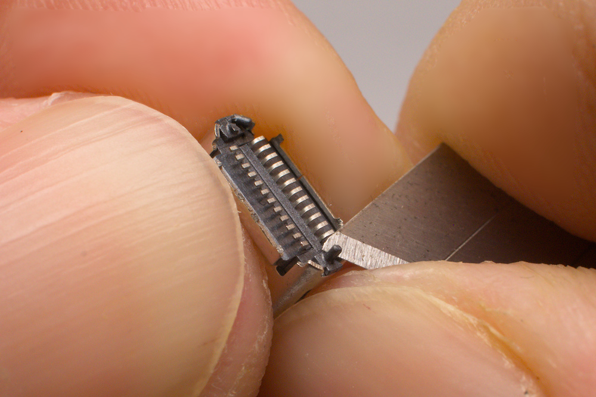](assembly_pics/typec04.jpg)

Now comes the tricky part: We have to bend the pins of the connector slightly inwards so they touch the board edge at an angle, but not so much that they don't reach the board edge or break off. The photos should give you an idea of how far to bend them.

Start by sliding the knife under roughly a quarter to half the pins on one side, and gently bend them inwards. Bending only part of the pins at once requires less force and therefore allows for better control. Take care to **rotate** the knife blade around the long axis, as opposed to using it as a lever, so that all pins receive equal force and bend the same way.

[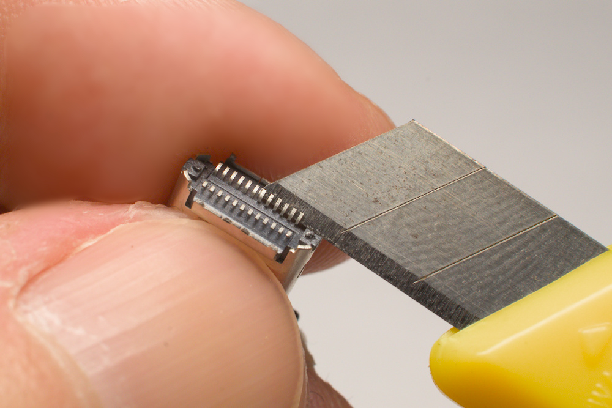](assembly_pics/typec05.jpg)[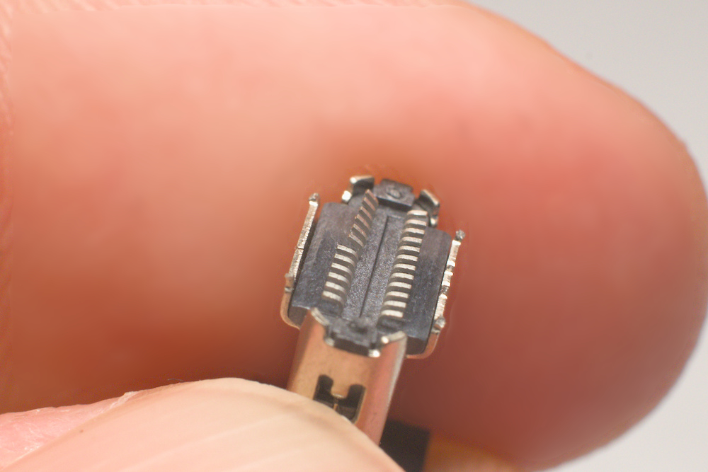](assembly_pics/typec06.jpg)

Move along the row of pins, bending groups of pins inwards until the entire row is bent.

[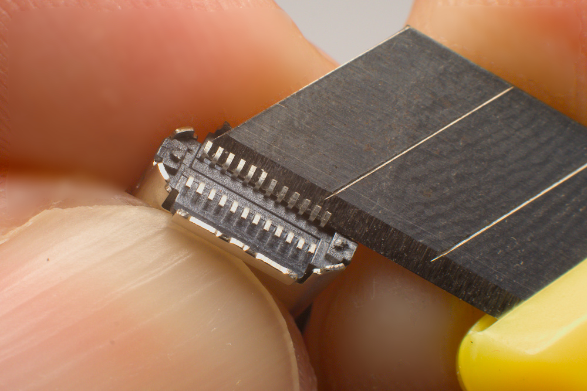](assembly_pics/typec07.jpg)

Repeat the same process on the other side; the end result should look something like this:

[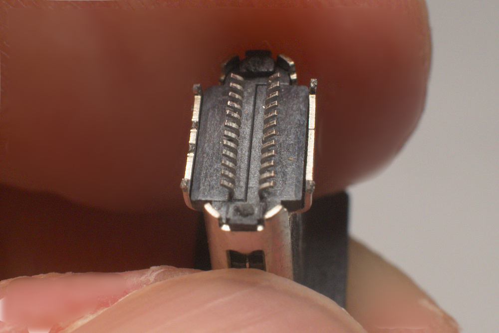](assembly_pics/typec08.jpg)

Now you can slide the connector into its place on the PCB. The PCB is designed such that the shell sits inside the PCB with a slight press fit. If you feel it's jammed in there too tightly you can simply sand off a little bit of the PCB, but sand off only very little and try to sand off both sides equally to maintain pin alignment.

[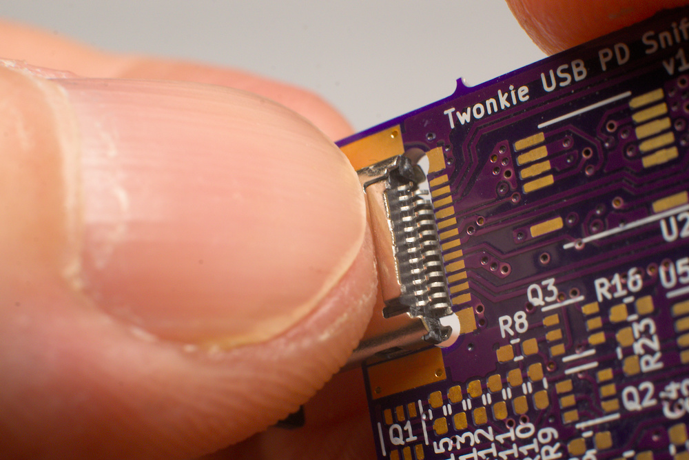](assembly_pics/typec09.jpg)

Push the connector all the way towards the board edge and adjust its position until it sits exactly centered and in line with the board:

[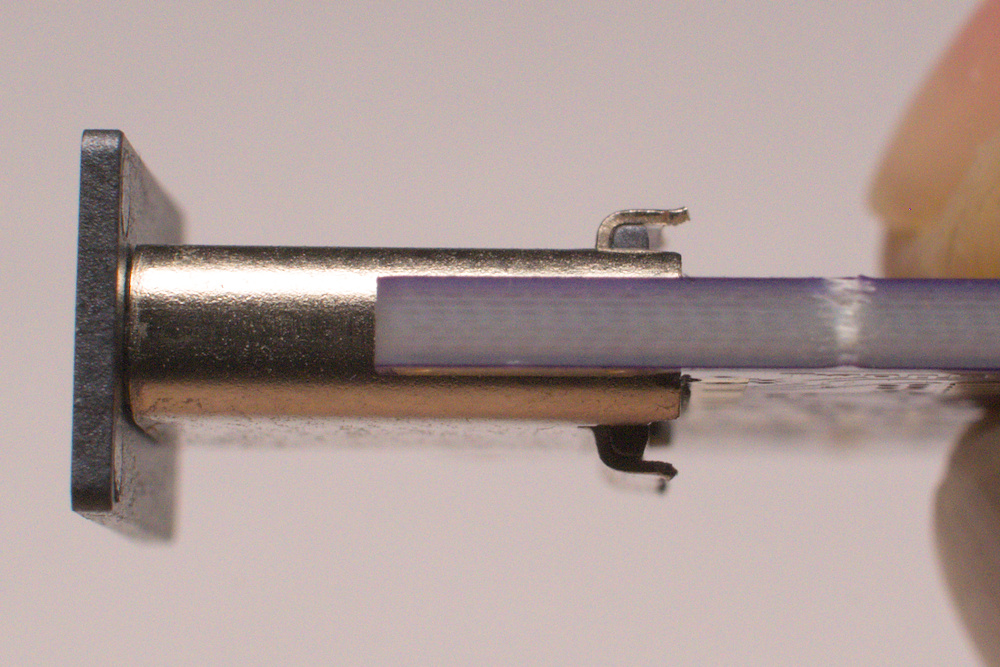](assembly_pics/typec10.jpg)

The pins on both sides should now align with the pads and touch the corner of the board edge. If there's a tiny gap that's no problem, the solder will bridge that. Larger gaps need to be fixed by adjusting the connector's position or bending the pins to compensate.

[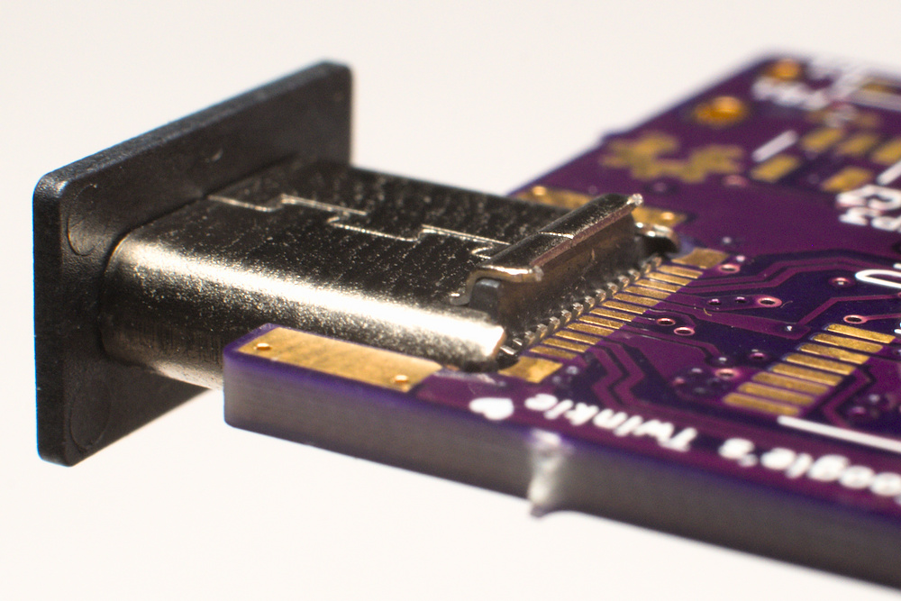](assembly_pics/typec11.jpg)[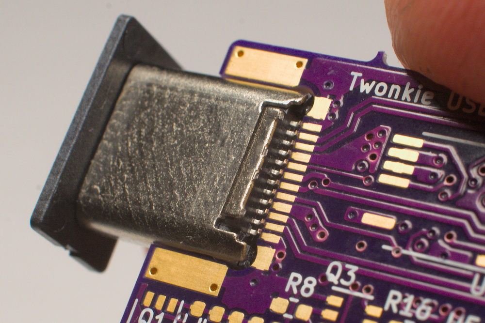](assembly_pics/typec12.jpg)

Once you're satisfied with the connector, tack down _one_ pin on one board side, double check that everything still looks good, then tack down _one_ pin on the opposite side. Triple check that everything still looks good, then you can drag solder all the pins into place.

When the pins have all been soldered, inspect them for missing connections or solder bridges and correct any that come up.

Finally you can solder down the shells: Using a soldering iron that can pump out a bit of heat (TS-80 is good, TS-100 is better, a powerful temperature controlled soldering station is best), first just pre-heat the shell for a bit, then add some solder and make sure it wets along the entire length of the neighboring pad. Then you can start heating the pad too and add loads of solder to make a solid connection. Do this on all four mounting pads and the connector won't go anywhere.

## Part 5: Enjoy!

And that's it! Clean your board with isopropanol and have fun with your new PD sniffer!

### Test 1: Sniff some power supply traffic

For starters, you can open a shell, type `tw trace on` and plug Twonkie in between a PD power supply and sink to watch them negotiate a power contract.

A very good test for many of the board devices is to do this in all four possible combinations of input and output plug orientation. The supply and sink should be able to negotiate a contract in all orientations, and Twonkie should be able to trace all of this. If some orientations don't work, check the solder joints on the USB-C connectors for bridges or opens - especially opens can be very sneaky with the haxxy edge mount we're using. If the connectors look alright, check the board devices next - especially the resistor banks and transistors are likely culprits since they directly interact with the USB-C control channels.

### Test 2: Twonkie as sink

The second test would be to attach only a power supply to Twonkie, with no sink at the other end, and type `tw sink` at the shell to put Twonkie into sink mode. (You may have to reconnect to the shell since Twonkie reboots into a different firmware.) Once in sink mode you can type `tw vbus` to watch what voltage the supply provides, and `pd 0 dev X` will limit the negotiated voltage to a maximum of `X` volts, so you can step through various supply voltages and watch them change. Test this in either plug orientation too; if you're having problems here you should double check the resistor banks on the control channels.

To go from sink mode back to sniffer mode you can type `reboot` at the shell.
